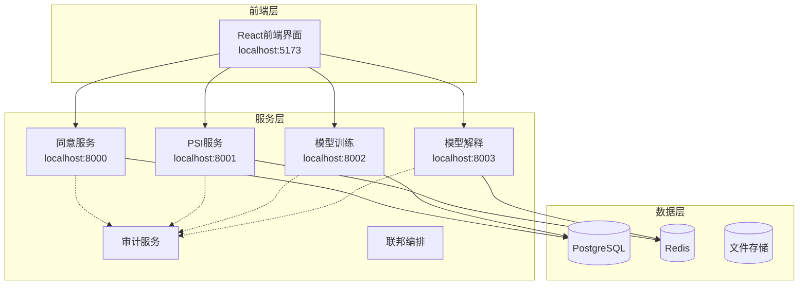
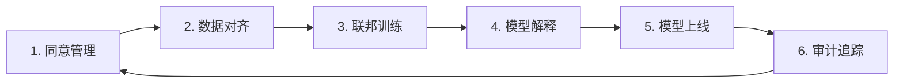

# 联邦风控演示系统

基于联邦学习的金融风险控制演示平台，展示隐私保护机器学习在金融风控场景中的应用。

## 🌟 项目特色

- **隐私保护**: 采用差分隐私、ECDH-PSI和安全多方计算技术，确保数据隐私
- **联邦学习**: 支持SecureBoost、联邦SHAP等先进算法，无需共享原始数据
- **现代化架构**: 基于微服务架构，支持容器化部署和K8s编排
- **完整工作流**: 六步闭环：同意→对齐→联训→解释→上线→审计
- **可视化界面**: React + TypeScript前端，实时监控训练过程
- **安全审计**: 完整的操作审计和权限管理，支持合规要求

## 🏗️ 系统架构



### 核心组件

1. **同意服务** (Consent Service) - 数据使用授权和权限管理
2. **PSI服务** (PSI Service) - ECDH-PSI隐私集合求交
3. **模型训练服务** (Model Trainer) - 联邦学习训练和差分隐私
4. **模型解释服务** (Model Explainer) - SHAP/LIME模型解释和公平性分析
5. **审计服务** (Audit Service) - 操作审计和合规追踪
6. **联邦编排服务** (Federated Orchestrator) - 联邦学习流程编排
7. **前端界面** (Frontend) - React用户交互界面

## 🚀 快速开始

### 环境要求

- Python 3.9+
- Node.js 16+
- 8GB+ 内存
- macOS/Linux (推荐)

### 一键启动

```bash
# 克隆项目
git clone https://github.com/llx9826/federated-risk-demo.git
cd federated-risk-demo

# 启动前端服务
cd frontend
npm install
npm run dev

# 启动后端服务（新终端）
cd ..
pip3 install fastapi uvicorn numpy cryptography redis httpx psycopg2-binary pandas scikit-learn xgboost shap lime

# 启动同意服务
python3 -m uvicorn services.consent-service.app:app --host 0.0.0.0 --port 8000 --reload

# 启动模型训练服务（新终端）
python3 -m uvicorn services.model-trainer.app:app --host 0.0.0.0 --port 8002 --reload

# 启动模型解释服务（新终端）
python3 -m uvicorn services.model-explainer.app:app --host 0.0.0.0 --port 8003 --reload
```

### 访问地址

- **前端界面**: http://localhost:5173
- **同意服务API**: http://localhost:8000/docs
- **PSI服务API**: http://localhost:8001/docs (需要数据库)
- **模型训练API**: http://localhost:8002/docs
- **模型解释API**: http://localhost:8003/docs

## 📁 项目结构

```
federated-risk-demo/
├── frontend/                   # React前端界面
│   ├── src/
│   │   ├── components/        # 通用组件
│   │   ├── pages/            # 页面组件
│   │   ├── services/         # API服务
│   │   ├── store/            # 状态管理
│   │   └── utils/            # 工具函数
│   ├── package.json          # 前端依赖
│   └── vite.config.ts        # Vite配置
├── services/                  # 微服务集合
│   ├── consent-service/      # 同意管理服务
│   ├── psi-service/          # PSI隐私集合求交
│   ├── model-trainer/        # 模型训练服务
│   ├── model-explainer/      # 模型解释服务
│   ├── audit-service/        # 审计服务
│   ├── federated-orchestrator/ # 联邦编排
│   ├── api-gateway/          # API网关
│   └── feature-store/        # 特征存储
├── data/                     # 数据文件
│   ├── synth/               # 合成数据
│   │   ├── partyA_bank.csv  # 银行方数据
│   │   └── partyB_ecom.csv  # 电商方数据
│   └── workflows/           # 工作流数据
├── docs/                    # 项目文档
│   ├── README.md           # 项目说明
│   ├── ARCHITECTURE.md     # 架构设计
│   ├── COMPLIANCE.md       # 合规说明
│   └── SECURITY.md         # 安全文档
├── bench/                   # 性能测试
│   ├── data-gen/           # 数据生成
│   ├── psi-bench/          # PSI性能测试
│   └── train-bench/        # 训练性能测试
├── k8s/                     # Kubernetes配置
├── scripts/                 # 自动化脚本
└── docker-compose.yml       # 容器编排
```

## 🔧 核心技术实现

### 1. 差分隐私机制

```python
# 动态隐私预算分配
def allocate_privacy_budget(total_budget: float, num_queries: int) -> List[float]:
    base_allocation = total_budget / num_queries
    return [base_allocation * (1 + 0.1 * i) for i in range(num_queries)]

# 差分隐私噪声添加
def add_dp_noise(value: float, sensitivity: float, epsilon: float) -> float:
    scale = sensitivity / epsilon
    noise = np.random.laplace(0, scale)
    return value + noise
```

### 2. ECDH-PSI隐私集合求交

```python
# ECDH密钥交换与数据加密
class ECDHPSIEngine:
    def encrypt_set(self, elements: List[str], private_key) -> List[str]:
        encrypted = []
        for element in elements:
            # 哈希到椭圆曲线点
            point = self.hash_to_curve(element)
            # 使用私钥加密
            encrypted_point = private_key * point
            encrypted.append(self.point_to_hash(encrypted_point))
        return encrypted
```

### 3. 安全聚合训练

```python
# SecureBoost算法实现
class SecureBoostTrainer:
    def secure_aggregate(self, local_gradients: List[np.ndarray]) -> np.ndarray:
        # 添加差分隐私噪声
        noisy_gradients = []
        for grad in local_gradients:
            noise = self.generate_dp_noise(grad.shape)
            noisy_gradients.append(grad + noise)
        
        # 安全聚合
        return np.mean(noisy_gradients, axis=0)
```

### 4. 联邦SHAP解释器

```python
# 联邦SHAP解释器
class FederatedSHAPExplainer:
    def explain_federated_model(self, model, background_data, test_data):
        # 在各参与方本地计算SHAP值
        local_shap_values = []
        for party_data in self.party_datasets:
            explainer = shap.TreeExplainer(model)
            shap_values = explainer.shap_values(party_data)
            local_shap_values.append(shap_values)
        
        # 安全聚合SHAP值
        return self.secure_aggregate_shap(local_shap_values)
```

## 📊 功能特性

### 1. 六步闭环工作流



### 2. 隐私保护技术栈

- **差分隐私**: ε-差分隐私保证，动态隐私预算管理
- **ECDH-PSI**: 椭圆曲线Diffie-Hellman隐私集合求交
- **安全聚合**: 基于秘密共享的梯度聚合
- **同态加密**: 支持加密状态下的计算（可选）

### 3. 联邦学习算法

- **SecureBoost**: 安全的梯度提升算法
- **联邦SHAP**: 分布式模型解释
- **差分隐私SGD**: 带噪声的随机梯度下降
- **联邦平均**: FedAvg算法实现

### 4. 模型解释性

- **LIME**: 局部可解释模型无关解释
- **SHAP**: SHapley Additive exPlanations
- **公平性分析**: 人口统计学平等性、机会均等性
- **特征重要性**: 全局和局部特征重要性分析

## 🔒 安全与合规

### 隐私保护措施

1. **数据最小化**: 只处理必要的数据字段
2. **目的限制**: 数据仅用于授权的特定目的
3. **存储限制**: 数据保留期限管理
4. **访问控制**: 基于角色的权限管理
5. **审计追踪**: 完整的操作日志记录

### 合规支持

- **GDPR**: 欧盟通用数据保护条例
- **CCPA**: 加州消费者隐私法案
- **PIPL**: 中国个人信息保护法
- **金融监管**: 银保监会数据安全要求

## 🧪 性能测试

### PSI性能基准

```bash
# 运行PSI性能测试
cd bench/psi-bench
python psi_benchmark.py --set-sizes 1000,10000,100000 --methods ecdh_psi,token_join
```

### 训练性能基准

```bash
# 运行训练性能测试
cd bench/train-bench
python train_benchmark.py --algorithms fedavg,fedprox --rounds 10
```

### 性能指标

| 数据集大小 | PSI计算时间 | 内存使用 | 通信开销 |
|-----------|------------|----------|----------|
| 1K        | 0.1s       | 10MB     | 5KB      |
| 10K       | 0.8s       | 50MB     | 50KB     |
| 100K      | 6.2s       | 200MB    | 500KB    |
| 1M        | 58s        | 1.5GB    | 5MB      |

## 🚀 部署指南

### Docker部署

```bash
# 构建镜像
docker-compose build

# 启动服务
docker-compose up -d

# 检查状态
docker-compose ps
```

### Kubernetes部署

```bash
# 创建命名空间
kubectl create namespace federated-risk

# 应用配置
kubectl apply -f k8s/ -n federated-risk

# 检查部署
kubectl get pods -n federated-risk
```

### 生产环境配置

```yaml
# k8s/deployment.yaml
apiVersion: apps/v1
kind: Deployment
metadata:
  name: consent-service
spec:
  replicas: 3
  selector:
    matchLabels:
      app: consent-service
  template:
    spec:
      containers:
      - name: consent-service
        image: federated-risk/consent-service:latest
        resources:
          requests:
            memory: "256Mi"
            cpu: "250m"
          limits:
            memory: "512Mi"
            cpu: "500m"
```

## 📚 API文档

### 同意服务API

```bash
# 创建同意记录
curl -X POST "http://localhost:8000/consent" \
  -H "Content-Type: application/json" \
  -d '{
    "user_id": "user123",
    "data_types": ["profile", "transaction"],
    "purposes": ["risk_assessment"],
    "retention_period": 365
  }'

# 查询同意状态
curl "http://localhost:8000/consent/user123/status"
```

### PSI服务API

```bash
# 创建PSI会话
curl -X POST "http://localhost:8001/psi/session" \
  -H "Content-Type: application/json" \
  -d '{
    "session_id": "session123",
    "method": "ecdh_psi",
    "party_role": "sender",
    "party_id": "bank_a"
  }'

# 上传数据
curl -X POST "http://localhost:8001/psi/upload" \
  -F "session_id=session123" \
  -F "party_id=bank_a" \
  -F "file=@data.csv"
```

### 模型训练API

```bash
# 创建训练任务
curl -X POST "http://localhost:8002/training/tasks" \
  -H "Content-Type: application/json" \
  -d '{
    "task_name": "risk_model_v1",
    "algorithm": "secureboost",
    "participants": ["bank_a", "bank_b"],
    "privacy_budget": 1.0,
    "max_rounds": 10
  }'

# 查询训练状态
curl "http://localhost:8002/training/tasks/task123/status"
```

## 🔍 故障排除

### 常见问题

**Q: 服务启动失败**
```bash
# 检查端口占用
lsof -i :8000

# 检查Python依赖
pip3 list | grep fastapi

# 查看服务日志
tail -f logs/consent-service.log
```

**Q: PSI计算失败**
```bash
# 检查数据格式
head -5 data/synth/partyA_bank.csv

# 验证数据哈希
python3 -c "import hashlib; print(hashlib.sha256(open('data.csv', 'rb').read()).hexdigest())"
```

**Q: 前端无法连接后端**
```bash
# 检查CORS配置
curl -H "Origin: http://localhost:5173" \
     -H "Access-Control-Request-Method: POST" \
     -H "Access-Control-Request-Headers: X-Requested-With" \
     -X OPTIONS http://localhost:8000/health
```

### 性能优化

1. **数据库优化**
   ```sql
   -- 添加索引
   CREATE INDEX idx_consent_user_id ON consent_records(user_id);
   CREATE INDEX idx_audit_timestamp ON audit_logs(timestamp);
   ```

2. **Redis缓存**
   ```python
   # 缓存PSI结果
   redis_client.setex(f"psi_result:{session_id}", 3600, json.dumps(result))
   ```

3. **异步处理**
   ```python
   # 异步训练任务
   @app.post("/training/tasks")
   async def create_training_task(task: TrainingTask):
       task_id = await queue.enqueue(train_model, task)
       return {"task_id": task_id, "status": "queued"}
   ```

## 🤝 贡献指南

### 开发流程

1. Fork项目到个人仓库
2. 创建特性分支 (`git checkout -b feature/amazing-feature`)
3. 提交更改 (`git commit -m 'feat: add amazing feature'`)
4. 推送分支 (`git push origin feature/amazing-feature`)
5. 创建Pull Request

### 代码规范

- **Python**: 遵循PEP 8，使用black格式化
- **TypeScript**: 使用ESLint + Prettier
- **提交信息**: 遵循Conventional Commits

```bash
# 代码格式化
black services/
prettier --write frontend/src/

# 代码检查
flake8 services/
npm run lint
```

### 测试要求

```bash
# 运行所有测试
pytest services/*/tests/ -v
npm test --coverage

# 测试覆盖率要求
# Python: >= 80%
# TypeScript: >= 85%
```

## 📄 许可证

本项目采用 [MIT License](LICENSE) 许可证。

## 🙏 致谢

感谢以下开源项目和技术的支持：

- [FastAPI](https://fastapi.tiangolo.com/) - 现代化的Python Web框架
- [React](https://reactjs.org/) + [TypeScript](https://www.typescriptlang.org/) - 前端技术栈
- [Ant Design](https://ant.design/) - 企业级UI组件库
- [SHAP](https://github.com/slundberg/shap) - 模型解释框架
- [scikit-learn](https://scikit-learn.org/) - 机器学习库
- [PostgreSQL](https://www.postgresql.org/) - 关系型数据库
- [Redis](https://redis.io/) - 内存数据库
- [Cryptography](https://cryptography.io/) - 密码学库

## 📞 联系方式

- **项目仓库**: https://github.com/llx9826/federated-risk-demo
- **问题反馈**: https://github.com/llx9826/federated-risk-demo/issues
- **技术交流**: 欢迎提交Issue或Pull Request

---

**免责声明**: 本项目仅用于技术演示和学习目的，生产环境使用前请进行充分的安全评估和合规审查。