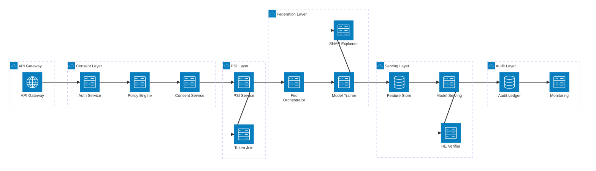
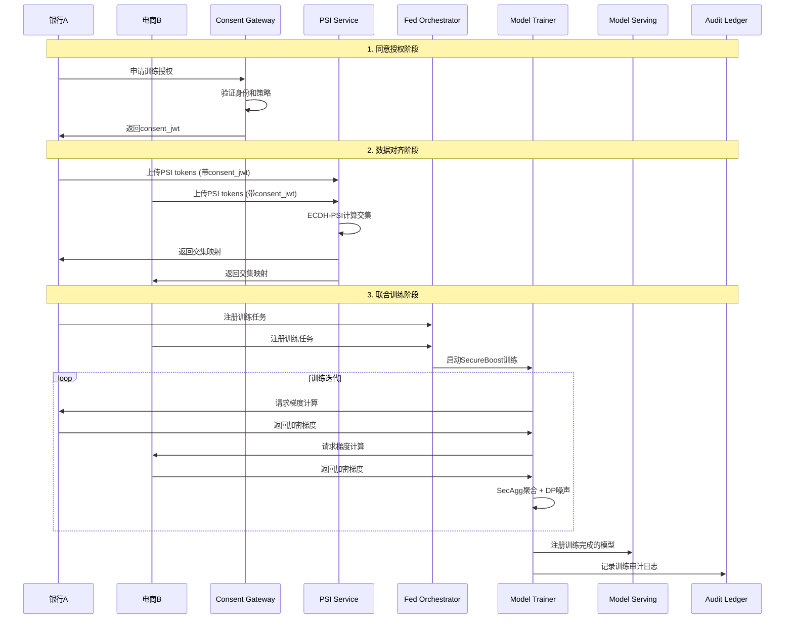
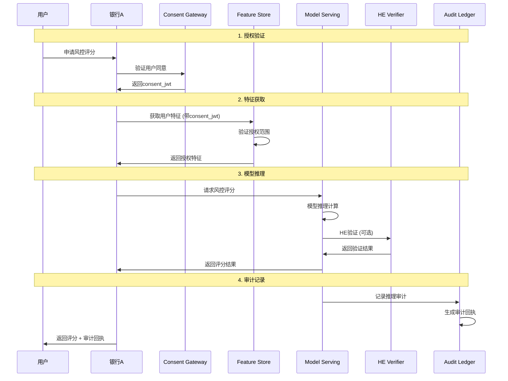
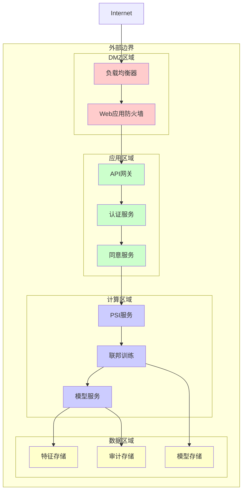
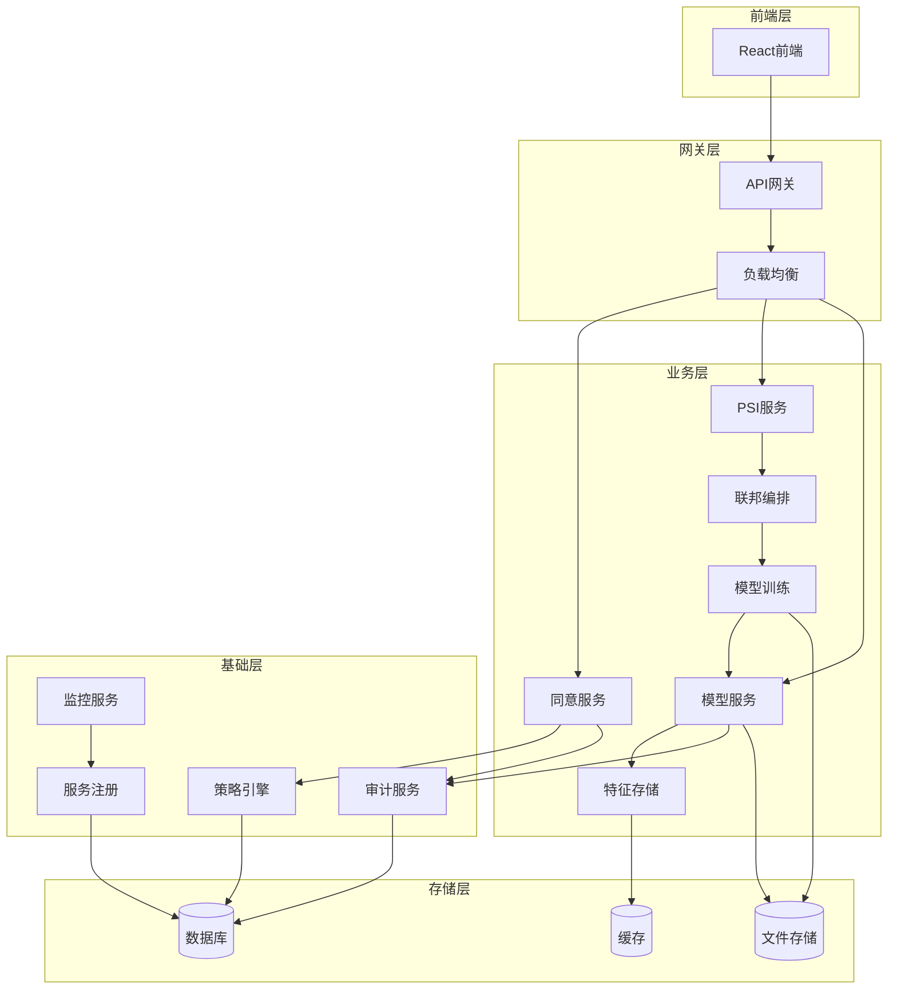
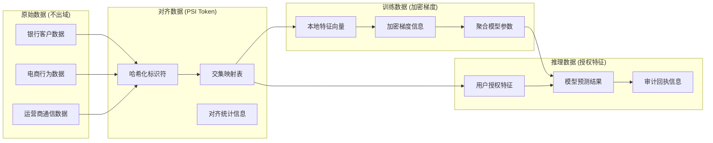
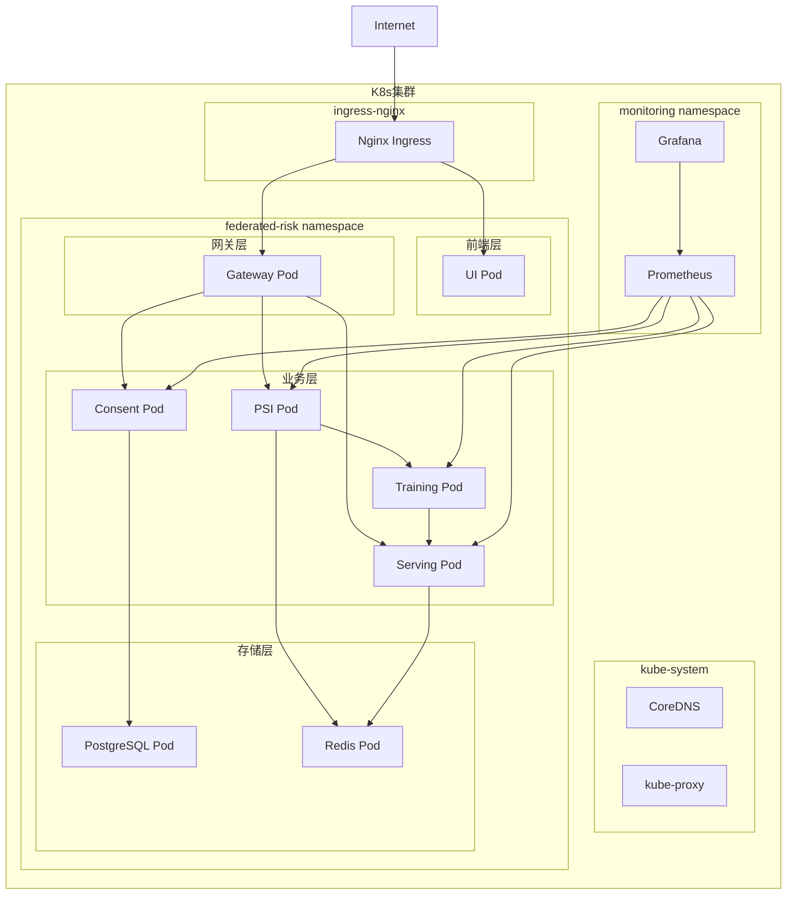
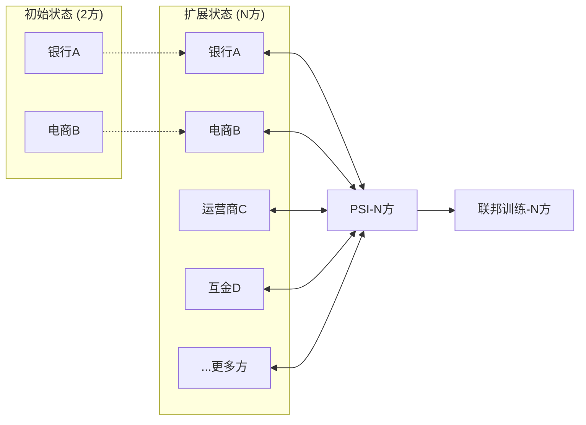
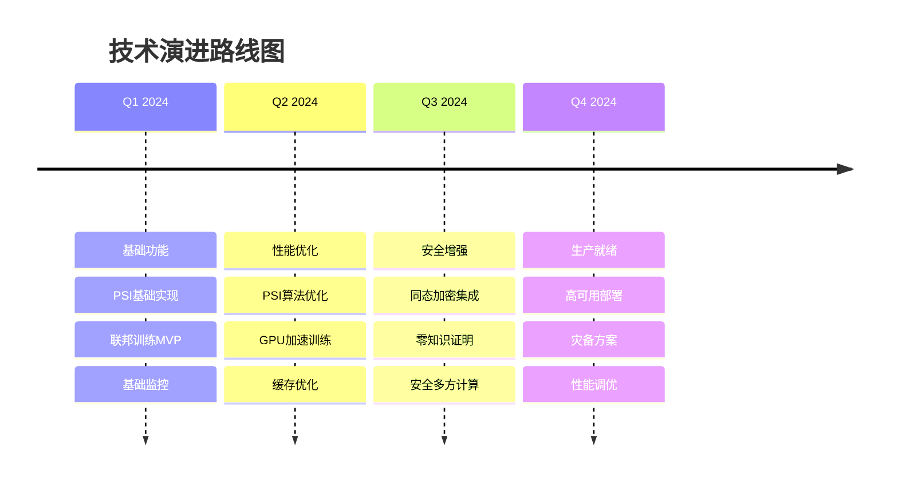

# 系统架构设计

## 总体架构

### 架构原则
- **数据不出域**：所有原始数据保留在各方本地
- **最小权限**：基于用途和时效的精细化授权
- **可观测性**：全链路监控和审计追踪
- **弹性扩展**：支持水平扩展和多方动态加入
- **安全第一**：端到端加密和隐私保护

### 系统全景图



## 数据流设计

### 训练阶段数据流



### 推理阶段数据流



## 威胁建模

### 威胁分析矩阵

| 威胁类型 | 威胁描述 | 影响等级 | 缓解措施 | 责任方 |
|----------|----------|----------|----------|--------|
| **数据泄露** | 训练/推理过程中原始数据泄露 | 高 | SecAgg+DP+同态加密 | 技术团队 |
| **模型窃取** | 通过推理API逆向工程模型 | 中 | 访问频率限制+差分隐私 | 安全团队 |
| **身份伪造** | 恶意方伪造身份参与联邦 | 高 | mTLS+数字证书+身份验证 | 安全团队 |
| **同意绕过** | 绕过用户同意直接访问数据 | 高 | 强制同意验证+审计日志 | 合规团队 |
| **拒绝服务** | 恶意请求导致服务不可用 | 中 | 限流+负载均衡+监控 | 运维团队 |
| **数据投毒** | 恶意方注入有害训练数据 | 中 | 数据质量检查+异常检测 | 算法团队 |
| **梯度泄露** | 通过梯度信息推断原始数据 | 中 | SecAgg+差分隐私 | 技术团队 |
| **重放攻击** | 重复使用历史请求进行攻击 | 低 | 时间戳+nonce+签名 | 安全团队 |

### 安全边界



## 微服务架构

### 服务依赖图



### 服务清单

| 服务名称 | 端口 | 职责 | 技术栈 | 扩展性 |
|----------|------|------|--------|--------|
| **consent-gateway** | 7002 | 同意管理、策略验证 | FastAPI+Casbin+JWT | 水平扩展 |
| **psi-service** | 7001 | 隐私集合交集计算 | FastAPI+ECDH | 水平扩展 |
| **federated-orchestrator** | 7003 | 联邦训练编排 | FastAPI+Celery | 水平扩展 |
| **model-trainer** | 7004 | 模型训练执行 | FATE/Flower+GPU | 垂直扩展 |
| **model-serving** | 7005 | 在线推理服务 | FastAPI+ONNX | 水平扩展 |
| **feature-store** | 7006 | 特征存储管理 | Feast+Redis | 水平扩展 |
| **monitoring** | 7007 | 监控指标收集 | Prometheus+Grafana | 水平扩展 |
| **audit-ledger** | 7008 | 审计日志存储 | FastAPI+PostgreSQL | 水平扩展 |
| **policy** | 7009 | 策略决策引擎 | OPA+Rego | 水平扩展 |

## 数据架构

### 数据分类



### 存储策略

| 数据类型 | 存储方式 | 加密方式 | 保留期限 | 访问控制 |
|----------|----------|----------|----------|----------|
| **用户同意** | PostgreSQL | AES-256-GCM | 7年 | 基于角色 |
| **PSI Token** | Redis | 内存加密 | 24小时 | 基于会话 |
| **模型参数** | 文件存储 | AES-256-GCM | 永久 | 基于版本 |
| **审计日志** | PostgreSQL | AES-256-GCM | 10年 | 只读访问 |
| **特征数据** | Redis | 内存加密 | 1小时 | 基于授权 |
| **监控指标** | InfluxDB | TLS传输 | 1年 | 基于角色 |

## 部署架构

### Kubernetes部署拓扑



### 网络策略

```yaml
# 示例网络策略
apiVersion: networking.k8s.io/v1
kind: NetworkPolicy
metadata:
  name: federated-risk-network-policy
  namespace: federated-risk
spec:
  podSelector: {}
  policyTypes:
  - Ingress
  - Egress
  ingress:
  - from:
    - namespaceSelector:
        matchLabels:
          name: ingress-nginx
    ports:
    - protocol: TCP
      port: 8080
  - from:
    - podSelector:
        matchLabels:
          app: consent-service
    ports:
    - protocol: TCP
      port: 7002
  egress:
  - to:
    - podSelector:
        matchLabels:
          app: postgresql
    ports:
    - protocol: TCP
      port: 5432
  - to:
    - podSelector:
        matchLabels:
          app: redis
    ports:
    - protocol: TCP
      port: 6379
```

## 扩展性设计

### 水平扩展策略

1. **无状态服务**：所有API服务设计为无状态，支持任意副本数扩展
2. **数据分片**：PSI计算支持数据分片并行处理
3. **负载均衡**：基于一致性哈希的智能路由
4. **缓存策略**：多级缓存减少数据库压力

### 垂直扩展策略

1. **GPU加速**：模型训练支持GPU集群
2. **内存优化**：大数据集的流式处理
3. **存储优化**：冷热数据分离存储
4. **计算优化**：算法并行化和向量化

### 多方扩展



## 性能指标

### 关键性能指标 (KPI)

| 指标类型 | 指标名称 | 目标值 | 监控方式 |
|----------|----------|--------|----------|
| **吞吐量** | PSI对齐TPS | >1000 req/s | Prometheus |
| **延迟** | 推理响应时间 | <100ms P95 | APM |
| **可用性** | 服务可用率 | >99.9% | 健康检查 |
| **准确性** | 模型AUC | >0.75 | 模型监控 |
| **安全性** | 隐私预算消耗 | <ε=5 | 差分隐私监控 |
| **合规性** | 审计覆盖率 | 100% | 审计日志 |

### 容量规划

| 资源类型 | 当前配置 | 峰值配置 | 扩展策略 |
|----------|----------|----------|----------|
| **CPU** | 16核 | 64核 | HPA自动扩展 |
| **内存** | 32GB | 128GB | 垂直扩展 |
| **存储** | 1TB SSD | 10TB SSD | 存储扩容 |
| **网络** | 1Gbps | 10Gbps | 带宽升级 |
| **GPU** | 2张V100 | 8张A100 | GPU集群 |

## 技术债务管理

### 已知技术债务

1. **PSI算法优化**：当前使用简化版ECDH-PSI，需要升级到更高效的算法
2. **模型格式统一**：支持更多模型格式 (ONNX, TensorFlow, PyTorch)
3. **监控完善**：增加业务指标监控和告警
4. **文档完善**：API文档和运维文档需要持续更新

### 技术演进路线

