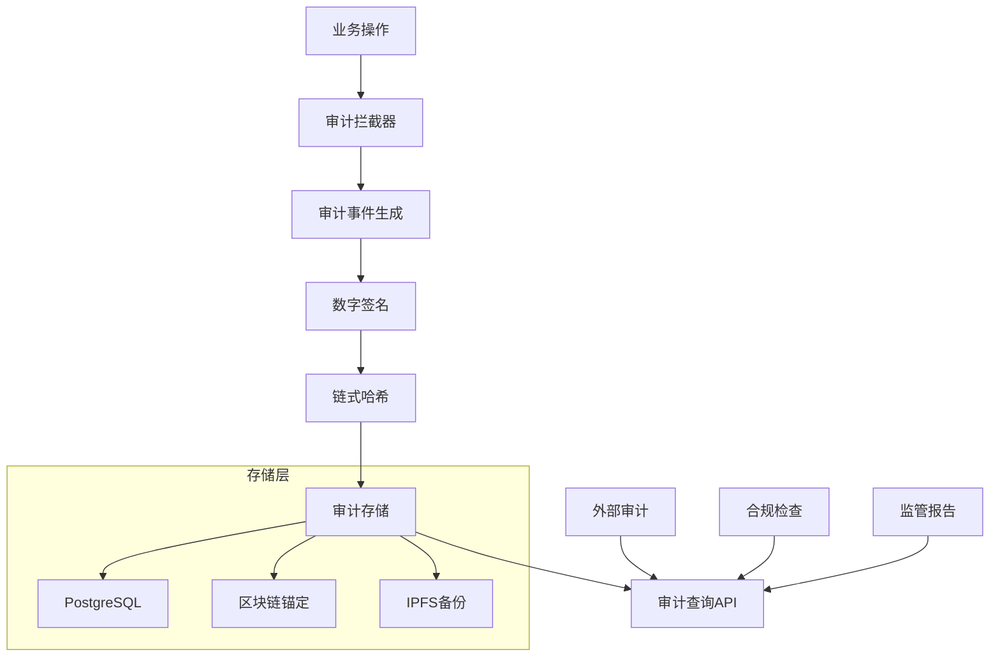

# 审计回执与链式存证规范

## 概述

本文档定义了联邦风控系统的审计回执格式、链式存证机制和合规要求，确保所有操作可追溯、不可篡改，满足金融监管要求。

## 审计架构



## 审计事件分类

### 核心业务事件

| 事件类型 | 事件代码 | 描述 | 敏感级别 |
|----------|----------|------|----------|
| **同意管理** | CONSENT_ISSUE | 同意票据签发 | HIGH |
| | CONSENT_REVOKE | 同意票据撤销 | HIGH |
| | CONSENT_VERIFY | 同意票据验证 | MEDIUM |
| **数据对齐** | PSI_START | PSI会话启动 | HIGH |
| | PSI_UPLOAD | 数据上传 | CRITICAL |
| | PSI_COMPUTE | 交集计算 | HIGH |
| **联合训练** | TRAIN_START | 训练启动 | HIGH |
| | TRAIN_ROUND | 训练轮次 | MEDIUM |
| | TRAIN_COMPLETE | 训练完成 | HIGH |
| **模型推理** | SCORE_REQUEST | 评分请求 | HIGH |
| | SCORE_RESPONSE | 评分响应 | HIGH |
| | MODEL_UPDATE | 模型更新 | CRITICAL |

### 系统管理事件

| 事件类型 | 事件代码 | 描述 | 敏感级别 |
|----------|----------|------|----------|
| **用户管理** | USER_LOGIN | 用户登录 | MEDIUM |
| | USER_LOGOUT | 用户登出 | LOW |
| | ROLE_CHANGE | 角色变更 | HIGH |
| **配置管理** | CONFIG_UPDATE | 配置更新 | HIGH |
| | POLICY_UPDATE | 策略更新 | CRITICAL |
| | KEY_ROTATION | 密钥轮换 | CRITICAL |
| **系统运维** | SERVICE_START | 服务启动 | MEDIUM |
| | SERVICE_STOP | 服务停止 | HIGH |
| | BACKUP_CREATE | 备份创建 | MEDIUM |

## 审计回执格式

### 标准审计回执

```json
{
  "audit_id": "audit_20240115_001234567",
  "version": "1.0",
  "timestamp": "2024-01-15T10:30:45.123Z",
  "event_type": "SCORE_REQUEST",
  "severity": "HIGH",
  "source": {
    "service": "model-serving",
    "instance_id": "ms-pod-abc123",
    "version": "v1.2.3",
    "node_id": "node-001"
  },
  "actor": {
    "user_id": "user_12345",
    "session_id": "sess_abcdef",
    "ip_address": "192.168.1.100",
    "user_agent": "FederatedRiskClient/1.0",
    "organization": "bank_a"
  },
  "operation": {
    "action": "score_customer",
    "resource": "customer_profile",
    "resource_id": "cust_789012",
    "method": "POST",
    "endpoint": "/api/v1/score",
    "parameters": {
      "customer_id": "cust_789012",
      "model_version": "v2.1.0",
      "features_hash": "sha256:abc123..."
    }
  },
  "result": {
    "status": "SUCCESS",
    "status_code": 200,
    "response_hash": "sha256:def456...",
    "processing_time_ms": 245,
    "model_hash": "sha256:model_v2.1.0_hash"
  },
  "privacy": {
    "consent_token": "consent_xyz789",
    "consent_fingerprint": "sha256:consent_hash",
    "purpose": "credit_scoring",
    "data_categories": ["financial", "behavioral"],
    "retention_period": "P2Y",
    "privacy_budget_used": 0.1
  },
  "security": {
    "request_hash": "sha256:request_full_hash",
    "signature": "RSA-SHA256:signature_value",
    "certificate_fingerprint": "sha256:cert_hash",
    "encryption_algorithm": "AES-256-GCM",
    "key_version": "key_v3"
  },
  "compliance": {
    "regulation": ["PIPL", "JR/T_0196"],
    "policy_version": "policy_v1.5",
    "risk_level": "MEDIUM",
    "approval_required": false,
    "data_classification": "CONFIDENTIAL"
  },
  "chain": {
    "previous_hash": "sha256:prev_audit_hash",
    "current_hash": "sha256:current_audit_hash",
    "merkle_root": "sha256:merkle_root_hash",
    "block_height": 12345,
    "nonce": "nonce_value"
  },
  "metadata": {
    "correlation_id": "corr_abc123",
    "trace_id": "trace_def456",
    "span_id": "span_ghi789",
    "tags": ["production", "high_value_customer"],
    "custom_fields": {
      "business_unit": "retail_banking",
      "product_type": "credit_card"
    }
  }
}
```

### 敏感操作审计回执

```json
{
  "audit_id": "audit_20240115_001234568",
  "version": "1.0",
  "timestamp": "2024-01-15T10:35:22.456Z",
  "event_type": "PSI_COMPUTE",
  "severity": "CRITICAL",
  "source": {
    "service": "psi-service",
    "instance_id": "psi-pod-xyz789",
    "version": "v1.1.2"
  },
  "operation": {
    "action": "compute_intersection",
    "participants": [
      {
        "organization": "bank_a",
        "data_size": 1000000,
        "data_hash": "sha256:bank_a_data_hash"
      },
      {
        "organization": "ecommerce_b",
        "data_size": 2000000,
        "data_hash": "sha256:ecommerce_b_data_hash"
      }
    ],
    "intersection_size": 150000,
    "intersection_hash": "sha256:intersection_hash"
  },
  "privacy": {
    "protocol": "ECDH-PSI",
    "security_parameter": 128,
    "differential_privacy": {
      "enabled": true,
      "epsilon": 1.0,
      "delta": 1e-6
    },
    "no_plaintext_exposure": true
  },
  "performance": {
    "computation_time_ms": 45000,
    "memory_usage_mb": 2048,
    "network_bytes": 104857600,
    "cpu_usage_percent": 85.5
  },
  "verification": {
    "zero_knowledge_proof": "zkp_proof_value",
    "commitment_hash": "sha256:commitment_hash",
    "witness_signature": "ecdsa_signature"
  }
}
```

## 链式存证机制

### 哈希链结构

```python
# services/audit-ledger/chain.py
class AuditChain:
    """审计链式存证"""
    
    def __init__(self, genesis_hash: str = None):
        self.genesis_hash = genesis_hash or self._create_genesis_hash()
        self.current_height = 0
        self.merkle_tree = MerkleTree()
    
    def add_audit_record(self, audit_record: dict) -> str:
        """添加审计记录到链中"""
        # 1. 计算记录哈希
        record_hash = self._compute_record_hash(audit_record)
        
        # 2. 获取前一个块的哈希
        previous_hash = self._get_previous_hash()
        
        # 3. 创建新块
        block = {
            "height": self.current_height + 1,
            "timestamp": datetime.utcnow().isoformat(),
            "previous_hash": previous_hash,
            "record_hash": record_hash,
            "merkle_root": self.merkle_tree.get_root(),
            "nonce": self._generate_nonce()
        }
        
        # 4. 计算块哈希
        block_hash = self._compute_block_hash(block)
        block["block_hash"] = block_hash
        
        # 5. 更新审计记录
        audit_record["chain"] = {
            "previous_hash": previous_hash,
            "current_hash": block_hash,
            "merkle_root": block["merkle_root"],
            "block_height": block["height"],
            "nonce": block["nonce"]
        }
        
        # 6. 存储到数据库
        self._store_block(block, audit_record)
        
        # 7. 更新状态
        self.current_height += 1
        self.merkle_tree.add_leaf(record_hash)
        
        return block_hash
    
    def verify_chain_integrity(self) -> bool:
        """验证链的完整性"""
        blocks = self._get_all_blocks()
        
        for i, block in enumerate(blocks):
            # 验证块哈希
            computed_hash = self._compute_block_hash(block)
            if computed_hash != block["block_hash"]:
                return False
            
            # 验证链接关系
            if i > 0:
                if block["previous_hash"] != blocks[i-1]["block_hash"]:
                    return False
        
        return True
    
    def _compute_record_hash(self, record: dict) -> str:
        """计算审计记录哈希"""
        # 排除链相关字段
        clean_record = {k: v for k, v in record.items() if k != "chain"}
        
        # 规范化JSON
        canonical_json = json.dumps(clean_record, sort_keys=True, separators=(',', ':'))
        
        # 计算SHA-256哈希
        return hashlib.sha256(canonical_json.encode()).hexdigest()
    
    def _compute_block_hash(self, block: dict) -> str:
        """计算块哈希"""
        # 排除块哈希字段
        clean_block = {k: v for k, v in block.items() if k != "block_hash"}
        
        # 规范化JSON
        canonical_json = json.dumps(clean_block, sort_keys=True, separators=(',', ':'))
        
        # 计算SHA-256哈希
        return hashlib.sha256(canonical_json.encode()).hexdigest()
```

### Merkle树实现

```python
# services/audit-ledger/merkle.py
class MerkleTree:
    """Merkle树实现"""
    
    def __init__(self):
        self.leaves = []
        self.tree = []
    
    def add_leaf(self, data_hash: str):
        """添加叶子节点"""
        self.leaves.append(data_hash)
        self._rebuild_tree()
    
    def get_root(self) -> str:
        """获取根哈希"""
        if not self.tree:
            return "0" * 64  # 空树的根哈希
        return self.tree[0]
    
    def get_proof(self, leaf_index: int) -> list:
        """获取Merkle证明"""
        if leaf_index >= len(self.leaves):
            raise ValueError("叶子索引超出范围")
        
        proof = []
        current_index = leaf_index + len(self.tree) - len(self.leaves)
        
        while current_index > 0:
            sibling_index = current_index ^ 1  # 异或操作获取兄弟节点
            if sibling_index < len(self.tree):
                proof.append({
                    "hash": self.tree[sibling_index],
                    "position": "right" if current_index % 2 == 0 else "left"
                })
            current_index = (current_index - 1) // 2
        
        return proof
    
    def verify_proof(self, leaf_hash: str, proof: list, root_hash: str) -> bool:
        """验证Merkle证明"""
        current_hash = leaf_hash
        
        for step in proof:
            if step["position"] == "left":
                current_hash = self._hash_pair(step["hash"], current_hash)
            else:
                current_hash = self._hash_pair(current_hash, step["hash"])
        
        return current_hash == root_hash
    
    def _rebuild_tree(self):
        """重建Merkle树"""
        if not self.leaves:
            self.tree = []
            return
        
        # 复制叶子节点
        current_level = self.leaves.copy()
        self.tree = current_level.copy()
        
        # 构建树的上层
        while len(current_level) > 1:
            next_level = []
            
            # 处理成对的节点
            for i in range(0, len(current_level), 2):
                left = current_level[i]
                right = current_level[i + 1] if i + 1 < len(current_level) else left
                parent_hash = self._hash_pair(left, right)
                next_level.append(parent_hash)
            
            # 将新层级添加到树的前面
            self.tree = next_level + self.tree
            current_level = next_level
    
    def _hash_pair(self, left: str, right: str) -> str:
        """计算一对哈希的父哈希"""
        combined = left + right
        return hashlib.sha256(combined.encode()).hexdigest()
```

## 审计存储

### 数据库模式

```sql
-- 审计记录表
CREATE TABLE audit_records (
    id BIGSERIAL PRIMARY KEY,
    audit_id VARCHAR(64) UNIQUE NOT NULL,
    event_type VARCHAR(32) NOT NULL,
    severity VARCHAR(16) NOT NULL,
    timestamp TIMESTAMPTZ NOT NULL,
    
    -- 源信息
    service_name VARCHAR(64) NOT NULL,
    instance_id VARCHAR(64),
    service_version VARCHAR(32),
    
    -- 操作者信息
    user_id VARCHAR(64),
    session_id VARCHAR(64),
    ip_address INET,
    organization VARCHAR(64),
    
    -- 操作信息
    action VARCHAR(64) NOT NULL,
    resource VARCHAR(64),
    resource_id VARCHAR(64),
    method VARCHAR(16),
    endpoint VARCHAR(256),
    
    -- 结果信息
    status VARCHAR(16) NOT NULL,
    status_code INTEGER,
    processing_time_ms INTEGER,
    
    -- 隐私信息
    consent_token VARCHAR(128),
    consent_fingerprint VARCHAR(64),
    purpose VARCHAR(64),
    privacy_budget_used DECIMAL(10,6),
    
    -- 安全信息
    request_hash VARCHAR(64) NOT NULL,
    response_hash VARCHAR(64),
    signature TEXT,
    encryption_algorithm VARCHAR(32),
    
    -- 合规信息
    regulation TEXT[],
    policy_version VARCHAR(32),
    risk_level VARCHAR(16),
    data_classification VARCHAR(32),
    
    -- 链信息
    previous_hash VARCHAR(64),
    current_hash VARCHAR(64) NOT NULL,
    merkle_root VARCHAR(64),
    block_height BIGINT,
    
    -- 元数据
    correlation_id VARCHAR(64),
    trace_id VARCHAR(64),
    tags TEXT[],
    custom_fields JSONB,
    
    -- 完整记录
    full_record JSONB NOT NULL,
    
    -- 索引
    CONSTRAINT unique_audit_id UNIQUE (audit_id),
    CONSTRAINT valid_severity CHECK (severity IN ('LOW', 'MEDIUM', 'HIGH', 'CRITICAL')),
    CONSTRAINT valid_status CHECK (status IN ('SUCCESS', 'FAILURE', 'ERROR', 'TIMEOUT'))
);

-- 创建索引
CREATE INDEX idx_audit_timestamp ON audit_records (timestamp);
CREATE INDEX idx_audit_event_type ON audit_records (event_type);
CREATE INDEX idx_audit_user_id ON audit_records (user_id);
CREATE INDEX idx_audit_organization ON audit_records (organization);
CREATE INDEX idx_audit_resource ON audit_records (resource, resource_id);
CREATE INDEX idx_audit_correlation ON audit_records (correlation_id);
CREATE INDEX idx_audit_hash ON audit_records (current_hash);
CREATE INDEX idx_audit_block_height ON audit_records (block_height);

-- 链块表
CREATE TABLE audit_blocks (
    id BIGSERIAL PRIMARY KEY,
    height BIGINT UNIQUE NOT NULL,
    timestamp TIMESTAMPTZ NOT NULL,
    previous_hash VARCHAR(64),
    block_hash VARCHAR(64) UNIQUE NOT NULL,
    merkle_root VARCHAR(64) NOT NULL,
    nonce VARCHAR(64) NOT NULL,
    record_count INTEGER NOT NULL DEFAULT 1,
    
    CONSTRAINT valid_height CHECK (height >= 0)
);

CREATE INDEX idx_blocks_height ON audit_blocks (height);
CREATE INDEX idx_blocks_hash ON audit_blocks (block_hash);
CREATE INDEX idx_blocks_timestamp ON audit_blocks (timestamp);

-- 审计查询视图
CREATE VIEW audit_summary AS
SELECT 
    DATE_TRUNC('hour', timestamp) as hour,
    event_type,
    severity,
    status,
    organization,
    COUNT(*) as event_count,
    AVG(processing_time_ms) as avg_processing_time,
    SUM(CASE WHEN status = 'FAILURE' THEN 1 ELSE 0 END) as failure_count
FROM audit_records 
GROUP BY DATE_TRUNC('hour', timestamp), event_type, severity, status, organization;
```

### 审计API

```python
# services/audit-ledger/api.py
from fastapi import FastAPI, HTTPException, Depends, Query
from typing import List, Optional
from datetime import datetime, timedelta

app = FastAPI(title="审计查询API")

@app.get("/audit/records")
async def query_audit_records(
    start_time: Optional[datetime] = Query(None),
    end_time: Optional[datetime] = Query(None),
    event_type: Optional[str] = Query(None),
    user_id: Optional[str] = Query(None),
    organization: Optional[str] = Query(None),
    severity: Optional[str] = Query(None),
    status: Optional[str] = Query(None),
    limit: int = Query(100, le=1000),
    offset: int = Query(0, ge=0)
):
    """查询审计记录"""
    
    query = "SELECT * FROM audit_records WHERE 1=1"
    params = []
    
    if start_time:
        query += " AND timestamp >= $" + str(len(params) + 1)
        params.append(start_time)
    
    if end_time:
        query += " AND timestamp <= $" + str(len(params) + 1)
        params.append(end_time)
    
    if event_type:
        query += " AND event_type = $" + str(len(params) + 1)
        params.append(event_type)
    
    if user_id:
        query += " AND user_id = $" + str(len(params) + 1)
        params.append(user_id)
    
    if organization:
        query += " AND organization = $" + str(len(params) + 1)
        params.append(organization)
    
    if severity:
        query += " AND severity = $" + str(len(params) + 1)
        params.append(severity)
    
    if status:
        query += " AND status = $" + str(len(params) + 1)
        params.append(status)
    
    query += " ORDER BY timestamp DESC"
    query += " LIMIT $" + str(len(params) + 1)
    params.append(limit)
    query += " OFFSET $" + str(len(params) + 1)
    params.append(offset)
    
    records = await database.fetch_all(query, params)
    return {"records": records, "total": len(records)}

@app.get("/audit/records/{audit_id}")
async def get_audit_record(audit_id: str):
    """获取特定审计记录"""
    
    record = await database.fetch_one(
        "SELECT * FROM audit_records WHERE audit_id = $1",
        audit_id
    )
    
    if not record:
        raise HTTPException(status_code=404, detail="审计记录未找到")
    
    return record

@app.get("/audit/verify/{audit_id}")
async def verify_audit_record(audit_id: str):
    """验证审计记录完整性"""
    
    record = await database.fetch_one(
        "SELECT * FROM audit_records WHERE audit_id = $1",
        audit_id
    )
    
    if not record:
        raise HTTPException(status_code=404, detail="审计记录未找到")
    
    # 验证记录哈希
    computed_hash = compute_record_hash(record["full_record"])
    hash_valid = computed_hash == record["current_hash"]
    
    # 验证链完整性
    chain_valid = await verify_chain_integrity(record["block_height"])
    
    # 验证数字签名
    signature_valid = verify_signature(
        record["full_record"],
        record["signature"]
    )
    
    return {
        "audit_id": audit_id,
        "hash_valid": hash_valid,
        "chain_valid": chain_valid,
        "signature_valid": signature_valid,
        "overall_valid": hash_valid and chain_valid and signature_valid
    }

@app.get("/audit/chain/verify")
async def verify_full_chain():
    """验证完整审计链"""
    
    chain = AuditChain()
    is_valid = chain.verify_chain_integrity()
    
    if is_valid:
        latest_block = await database.fetch_one(
            "SELECT * FROM audit_blocks ORDER BY height DESC LIMIT 1"
        )
        
        return {
            "chain_valid": True,
            "latest_block_height": latest_block["height"],
            "latest_block_hash": latest_block["block_hash"],
            "verification_time": datetime.utcnow().isoformat()
        }
    else:
        return {
            "chain_valid": False,
            "error": "链完整性验证失败"
        }

@app.get("/audit/statistics")
async def get_audit_statistics(
    start_time: Optional[datetime] = Query(None),
    end_time: Optional[datetime] = Query(None)
):
    """获取审计统计信息"""
    
    if not start_time:
        start_time = datetime.utcnow() - timedelta(days=7)
    if not end_time:
        end_time = datetime.utcnow()
    
    stats = await database.fetch_all("""
        SELECT 
            event_type,
            severity,
            status,
            COUNT(*) as count,
            AVG(processing_time_ms) as avg_time
        FROM audit_records 
        WHERE timestamp BETWEEN $1 AND $2
        GROUP BY event_type, severity, status
        ORDER BY count DESC
    """, start_time, end_time)
    
    return {
        "period": {
            "start": start_time.isoformat(),
            "end": end_time.isoformat()
        },
        "statistics": stats
    }

@app.post("/audit/export")
async def export_audit_records(
    start_time: datetime,
    end_time: datetime,
    format: str = "json",
    include_sensitive: bool = False
):
    """导出审计记录"""
    
    # 权限检查
    if include_sensitive and not check_admin_permission():
        raise HTTPException(status_code=403, detail="权限不足")
    
    records = await database.fetch_all("""
        SELECT * FROM audit_records 
        WHERE timestamp BETWEEN $1 AND $2
        ORDER BY timestamp
    """, start_time, end_time)
    
    if format == "csv":
        return export_to_csv(records, include_sensitive)
    elif format == "json":
        return export_to_json(records, include_sensitive)
    else:
        raise HTTPException(status_code=400, detail="不支持的导出格式")
```

## 合规检查

### 自动化合规检查

```python
# services/audit-ledger/compliance.py
class ComplianceChecker:
    """合规检查器"""
    
    def __init__(self):
        self.rules = self._load_compliance_rules()
    
    def check_record_compliance(self, audit_record: dict) -> dict:
        """检查单条记录的合规性"""
        
        results = {
            "compliant": True,
            "violations": [],
            "warnings": [],
            "recommendations": []
        }
        
        # PIPL合规检查
        pipl_result = self._check_pipl_compliance(audit_record)
        results["violations"].extend(pipl_result["violations"])
        results["warnings"].extend(pipl_result["warnings"])
        
        # JR/T 0196合规检查
        jrt0196_result = self._check_jrt0196_compliance(audit_record)
        results["violations"].extend(jrt0196_result["violations"])
        
        # JR/T 0197合规检查
        jrt0197_result = self._check_jrt0197_compliance(audit_record)
        results["violations"].extend(jrt0197_result["violations"])
        
        # 更新合规状态
        results["compliant"] = len(results["violations"]) == 0
        
        return results
    
    def _check_pipl_compliance(self, record: dict) -> dict:
        """检查PIPL合规性"""
        violations = []
        warnings = []
        
        # 检查同意要求
        if record.get("event_type") in ["SCORE_REQUEST", "PSI_COMPUTE"]:
            if not record.get("privacy", {}).get("consent_token"):
                violations.append({
                    "rule": "PIPL_Article_23",
                    "description": "处理个人信息需要取得个人同意",
                    "field": "privacy.consent_token"
                })
        
        # 检查目的限制
        purpose = record.get("privacy", {}).get("purpose")
        if purpose and purpose not in ["credit_scoring", "risk_assessment", "fraud_detection"]:
            warnings.append({
                "rule": "PIPL_Article_6",
                "description": "处理个人信息应当具有明确、合理的目的",
                "field": "privacy.purpose"
            })
        
        # 检查数据最小化
        data_categories = record.get("privacy", {}).get("data_categories", [])
        if len(data_categories) > 5:
            warnings.append({
                "rule": "PIPL_Article_6",
                "description": "应当限制在实现处理目的的最小范围",
                "field": "privacy.data_categories"
            })
        
        return {"violations": violations, "warnings": warnings}
    
    def _check_jrt0196_compliance(self, record: dict) -> dict:
        """检查JR/T 0196合规性"""
        violations = []
        
        # 检查审计记录完整性
        required_fields = [
            "audit_id", "timestamp", "event_type", "source",
            "operation", "result", "security"
        ]
        
        for field in required_fields:
            if field not in record:
                violations.append({
                    "rule": "JRT0196_5.2.1",
                    "description": f"审计记录缺少必需字段: {field}",
                    "field": field
                })
        
        # 检查数字签名
        if not record.get("security", {}).get("signature"):
            violations.append({
                "rule": "JRT0196_5.3.2",
                "description": "审计记录必须包含数字签名",
                "field": "security.signature"
            })
        
        return {"violations": violations}
    
    def _check_jrt0197_compliance(self, record: dict) -> dict:
        """检查JR/T 0197合规性"""
        violations = []
        
        # 检查隐私保护措施
        if record.get("event_type") == "PSI_COMPUTE":
            privacy_info = record.get("privacy", {})
            
            if not privacy_info.get("no_plaintext_exposure"):
                violations.append({
                    "rule": "JRT0197_6.1.1",
                    "description": "多方安全计算不得泄露明文数据",
                    "field": "privacy.no_plaintext_exposure"
                })
            
            if privacy_info.get("differential_privacy", {}).get("enabled"):
                epsilon = privacy_info["differential_privacy"].get("epsilon")
                if epsilon and epsilon > 10:
                    violations.append({
                        "rule": "JRT0197_6.2.1",
                        "description": "差分隐私参数ε过大，隐私保护不足",
                        "field": "privacy.differential_privacy.epsilon"
                    })
        
        return {"violations": violations}
```

## 监管报告

### 自动化报告生成

```python
# services/audit-ledger/reporting.py
class RegulatoryReporter:
    """监管报告生成器"""
    
    def generate_monthly_report(self, year: int, month: int) -> dict:
        """生成月度监管报告"""
        
        start_date = datetime(year, month, 1)
        if month == 12:
            end_date = datetime(year + 1, 1, 1)
        else:
            end_date = datetime(year, month + 1, 1)
        
        report = {
            "report_id": f"regulatory_{year}{month:02d}",
            "period": {
                "start": start_date.isoformat(),
                "end": end_date.isoformat()
            },
            "summary": self._generate_summary(start_date, end_date),
            "compliance": self._generate_compliance_report(start_date, end_date),
            "incidents": self._generate_incident_report(start_date, end_date),
            "privacy": self._generate_privacy_report(start_date, end_date),
            "security": self._generate_security_report(start_date, end_date)
        }
        
        return report
    
    def _generate_summary(self, start_date: datetime, end_date: datetime) -> dict:
        """生成摘要信息"""
        
        stats = database.fetch_one("""
            SELECT 
                COUNT(*) as total_events,
                COUNT(DISTINCT user_id) as unique_users,
                COUNT(DISTINCT organization) as participating_orgs,
                SUM(CASE WHEN event_type = 'SCORE_REQUEST' THEN 1 ELSE 0 END) as scoring_requests,
                SUM(CASE WHEN event_type = 'PSI_COMPUTE' THEN 1 ELSE 0 END) as psi_computations,
                SUM(CASE WHEN status = 'FAILURE' THEN 1 ELSE 0 END) as failed_operations
            FROM audit_records 
            WHERE timestamp BETWEEN $1 AND $2
        """, start_date, end_date)
        
        return {
            "total_events": stats["total_events"],
            "unique_users": stats["unique_users"],
            "participating_organizations": stats["participating_orgs"],
            "scoring_requests": stats["scoring_requests"],
            "psi_computations": stats["psi_computations"],
            "failed_operations": stats["failed_operations"],
            "success_rate": 1 - (stats["failed_operations"] / max(stats["total_events"], 1))
        }
    
    def _generate_compliance_report(self, start_date: datetime, end_date: datetime) -> dict:
        """生成合规报告"""
        
        # 获取所有审计记录
        records = database.fetch_all("""
            SELECT full_record FROM audit_records 
            WHERE timestamp BETWEEN $1 AND $2
        """, start_date, end_date)
        
        compliance_checker = ComplianceChecker()
        violations = []
        warnings = []
        
        for record in records:
            result = compliance_checker.check_record_compliance(record["full_record"])
            violations.extend(result["violations"])
            warnings.extend(result["warnings"])
        
        return {
            "total_violations": len(violations),
            "total_warnings": len(warnings),
            "violation_types": self._group_by_rule(violations),
            "warning_types": self._group_by_rule(warnings),
            "compliance_rate": 1 - (len(violations) / max(len(records), 1))
        }
```

## 总结

本审计规范提供了完整的审计回执和链式存证解决方案，包括：

- **标准化审计格式**：详细的JSON审计回执格式
- **链式存证机制**：基于哈希链和Merkle树的不可篡改存证
- **合规检查**：自动化的PIPL、JR/T 0196、JR/T 0197合规检查
- **审计查询API**：完整的审计记录查询和验证接口
- **监管报告**：自动化的监管报告生成

所有审计记录都经过数字签名和链式哈希验证，确保完整性和不可篡改性，满足金融监管的最高要求。