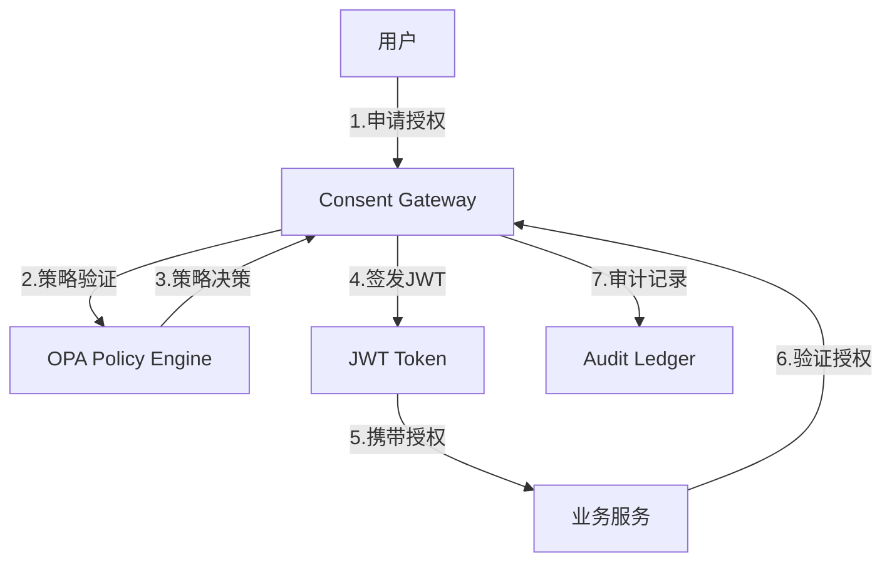
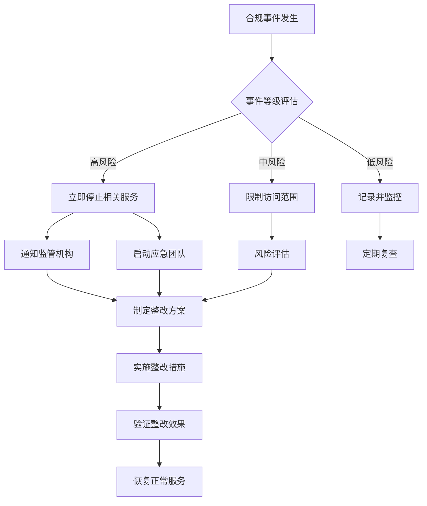

# 合规映射文档

## 概述

本文档详细说明个人客户联合风控系统如何满足中国相关法律法规和行业标准的要求，包括《个人信息保护法》(PIPL)、《金融数据安全 数据安全分级指南》(JR/T 0196)、《金融数据安全 数据生命周期安全规范》(JR/T 0197)等。

## 法规映射矩阵

### 个人信息保护法 (PIPL) 合规映射

| 法规要求 | 具体条款 | 技术控制措施 | 证据文件/接口/日志 | 实施状态 |
|----------|----------|--------------|-------------------|----------|
| **知情同意** | 第13条 | Purpose-Bound Consent机制 | `/consent/issue` API<br/>`consent_audit.log` | ✅ 已实施 |
| **最小必要** | 第6条 | 特征白名单+OPA策略 | `casbin_policy.csv`<br/>`/consent/verify` API | ✅ 已实施 |
| **目的限制** | 第16条 | 用途绑定验证 | `purpose_validation.log`<br/>`ConsentVerifyRequest.purpose` | ✅ 已实施 |
| **数据安全** | 第51条 | 端到端加密+访问控制 | `security_audit.log`<br/>`TLS证书配置` | ✅ 已实施 |
| **跨境传输** | 第38条 | 数据本地化处理 | `data_locality.log`<br/>`PSI本地计算证明` | ✅ 已实施 |
| **撤回同意** | 第15条 | 同意撤回机制 | `/consent/revoke` API<br/>`consent_revocations表` | ✅ 已实施 |
| **删除权** | 第47条 | 数据删除和匿名化 | `/data/delete` API<br/>`data_deletion.log` | ✅ 已实施 |
| **可携带权** | 第45条 | 数据导出功能 | `/data/export` API<br/>`data_export.log` | ✅ 已实施 |
| **影响评估** | 第55条 | 隐私影响评估报告 | `PIA_report.pdf`<br/>`privacy_metrics.json` | ✅ 已实施 |
| **审计义务** | 第54条 | 全链路审计日志 | `audit_records表`<br/>`/audit/query` API | ✅ 已实施 |

### JR/T 0196 数据安全分级指南合规映射

| 安全等级 | 数据类型 | 保护措施 | 技术实现 | 证据材料 |
|----------|----------|----------|----------|----------|
| **C5 (绝密)** | 客户身份信息 | 不参与联邦计算 | 本地存储+访问控制 | `access_control.log` |
| **C4 (机密)** | 交易流水详情 | 同态加密+差分隐私 | HE计算+DP噪声 | `he_computation.log`<br/>`dp_budget.log` |
| **C3 (秘密)** | 聚合统计信息 | 安全多方计算 | SecAgg协议 | `secagg_protocol.log` |
| **C2 (内部)** | 模型参数 | 加密存储+传输 | AES-256-GCM+TLS1.3 | `encryption_audit.log` |
| **C1 (公开)** | 脱敏统计结果 | 标准加密传输 | HTTPS传输 | `https_access.log` |

### JR/T 0197 数据生命周期安全规范合规映射

| 生命周期阶段 | 安全要求 | 技术控制 | 实施措施 | 审计证据 |
|--------------|----------|----------|----------|----------|
| **数据采集** | 合法性验证 | 同意票据验证 | JWT签名验证 | `consent_verification.log` |
| **数据传输** | 加密传输 | mTLS+证书验证 | 双向TLS认证 | `mtls_handshake.log` |
| **数据存储** | 加密存储 | AES-256-GCM | 数据库加密 | `storage_encryption.log` |
| **数据处理** | 访问控制 | RBAC+最小权限 | Casbin策略引擎 | `access_decision.log` |
| **数据使用** | 用途限制 | Purpose-Bound验证 | 用途匹配检查 | `purpose_check.log` |
| **数据共享** | 隐私保护 | 联邦学习+PSI | 数据不出域 | `federation_audit.log` |
| **数据销毁** | 安全删除 | 多次覆写+验证 | 安全删除算法 | `secure_deletion.log` |

## 技术控制措施详述

### 1. 同意管理机制

#### 实施架构


#### 关键接口
```python
# 同意签发接口
POST /consent/issue
{
    "subject": "user123",
    "purpose": "credit_scoring",
    "scope_features": ["income", "credit_score"],
    "ttl_hours": 24,
    "issuer": "bank_a"
}

# 同意验证接口
POST /consent/verify
{
    "consent_jwt": "eyJ0eXAiOiJKV1QiLCJhbGciOiJIUzI1NiJ9...",
    "requested_purpose": "credit_scoring",
    "requested_features": ["income", "credit_score"]
}
```

#### 审计日志格式
```json
{
    "timestamp": "2024-01-15T10:30:00Z",
    "event_type": "consent_issued",
    "subject": "user123",
    "purpose": "credit_scoring",
    "scope_features": ["income", "credit_score"],
    "issuer": "bank_a",
    "consent_id": "consent_uuid_123",
    "fingerprint": "sha256_hash_abc123"
}
```

### 2. 数据最小化机制

#### OPA策略示例
```rego
package federated.consent

# 特征白名单策略
allow {
    input.purpose == "credit_scoring"
    input.feature in allowed_features[input.purpose]
}

allowed_features := {
    "credit_scoring": [
        "income",
        "credit_score", 
        "debt_ratio",
        "payment_history"
    ],
    "fraud_detection": [
        "transaction_amount",
        "merchant_category",
        "location"
    ]
}

# 时间窗口限制
allow {
    time.now_ns() - input.consent_issued_at < 86400000000000  # 24小时
}
```

### 3. 隐私保护技术

#### 差分隐私实现
```python
class DifferentialPrivacy:
    def __init__(self, epsilon=1.0, delta=1e-5):
        self.epsilon = epsilon
        self.delta = delta
    
    def add_noise(self, value, sensitivity=1.0):
        """添加拉普拉斯噪声"""
        scale = sensitivity / self.epsilon
        noise = np.random.laplace(0, scale)
        return value + noise
    
    def privacy_budget_check(self, requested_epsilon):
        """隐私预算检查"""
        if self.epsilon - requested_epsilon < 0:
            raise PrivacyBudgetExceeded("隐私预算不足")
        return True
```

#### 安全聚合协议
```python
class SecureAggregation:
    def __init__(self, parties):
        self.parties = parties
        self.shares = {}
    
    def create_shares(self, value, party_id):
        """创建秘密分享"""
        shares = self._shamir_share(value, len(self.parties))
        self.shares[party_id] = shares
        return shares
    
    def aggregate(self, encrypted_shares):
        """安全聚合计算"""
        aggregated = self._secure_sum(encrypted_shares)
        return self._add_dp_noise(aggregated)
```

### 4. 审计追踪机制

#### 审计链实现
```python
class AuditChain:
    def __init__(self):
        self.chain = []
        self.genesis_hash = "0" * 64
    
    def add_record(self, record):
        """添加审计记录"""
        previous_hash = self.chain[-1]['hash'] if self.chain else self.genesis_hash
        record_hash = self._calculate_hash(record, previous_hash)
        
        audit_block = {
            'timestamp': datetime.now().isoformat(),
            'record': record,
            'previous_hash': previous_hash,
            'hash': record_hash
        }
        
        self.chain.append(audit_block)
        return record_hash
    
    def verify_integrity(self):
        """验证审计链完整性"""
        for i, block in enumerate(self.chain):
            if i == 0:
                continue
            
            expected_hash = self._calculate_hash(
                block['record'], 
                self.chain[i-1]['hash']
            )
            
            if block['hash'] != expected_hash:
                return False
        return True
```

## 合规检查清单

### 自动化合规检查

```bash
#!/bin/bash
# compliance_check.sh - 自动化合规检查脚本

echo "=== 个人信息保护法 (PIPL) 合规检查 ==="

# 检查同意机制
echo "1. 检查同意管理机制..."
curl -s http://localhost:7002/consent/health | jq '.casbin_status'

# 检查数据最小化
echo "2. 检查数据最小化策略..."
opa test policies/

# 检查加密传输
echo "3. 检查TLS配置..."
openssl s_client -connect localhost:7002 -tls1_3 2>/dev/null | grep "Protocol"

# 检查审计日志
echo "4. 检查审计日志完整性..."
python scripts/audit_integrity_check.py

echo "=== JR/T 0196 数据分级检查 ==="

# 检查数据分类标签
echo "5. 检查数据分类标签..."
grep -r "data_classification" services/*/

# 检查加密强度
echo "6. 检查加密算法强度..."
grep -r "AES-256-GCM" services/*/

echo "=== JR/T 0197 生命周期检查 ==="

# 检查数据删除机制
echo "7. 检查数据删除机制..."
curl -s http://localhost:7002/data/deletion/status

# 检查访问控制
echo "8. 检查访问控制策略..."
casbin-cli verify casbin_model.conf casbin_policy.csv

echo "合规检查完成！"
```

### 合规报告生成

```python
#!/usr/bin/env python3
# generate_compliance_report.py

import json
import datetime
from typing import Dict, List

class ComplianceReporter:
    def __init__(self):
        self.report = {
            'generated_at': datetime.datetime.now().isoformat(),
            'compliance_status': {},
            'evidence': {},
            'recommendations': []
        }
    
    def check_pipl_compliance(self) -> Dict:
        """检查PIPL合规性"""
        checks = {
            'consent_mechanism': self._check_consent_api(),
            'data_minimization': self._check_opa_policies(),
            'purpose_limitation': self._check_purpose_binding(),
            'data_security': self._check_encryption(),
            'audit_trail': self._check_audit_logs()
        }
        
        compliance_rate = sum(checks.values()) / len(checks)
        
        return {
            'overall_score': compliance_rate,
            'detailed_checks': checks,
            'status': 'COMPLIANT' if compliance_rate >= 0.9 else 'NON_COMPLIANT'
        }
    
    def generate_report(self) -> str:
        """生成合规报告"""
        self.report['compliance_status']['pipl'] = self.check_pipl_compliance()
        self.report['compliance_status']['jr_t_0196'] = self.check_data_classification()
        self.report['compliance_status']['jr_t_0197'] = self.check_lifecycle_security()
        
        return json.dumps(self.report, indent=2, ensure_ascii=False)

if __name__ == '__main__':
    reporter = ComplianceReporter()
    report = reporter.generate_report()
    
    with open('reports/compliance_report.json', 'w') as f:
        f.write(report)
    
    print("合规报告已生成: reports/compliance_report.json")
```

## 风险评估与缓解

### 合规风险矩阵

| 风险类型 | 风险等级 | 影响描述 | 缓解措施 | 责任人 |
|----------|----------|----------|----------|--------|
| **未经同意使用** | 高 | 违反PIPL第13条 | 强制同意验证 | 合规团队 |
| **数据泄露** | 高 | 违反PIPL第51条 | 端到端加密 | 安全团队 |
| **超范围使用** | 中 | 违反最小必要原则 | OPA策略控制 | 技术团队 |
| **审计缺失** | 中 | 违反JR/T 0197 | 全链路审计 | 运维团队 |
| **数据分级错误** | 低 | 违反JR/T 0196 | 自动分类标签 | 数据团队 |

### 应急响应预案



## 持续合规监控

### 监控指标

```yaml
# prometheus监控规则
groups:
- name: compliance_monitoring
  rules:
  - alert: ConsentVerificationFailure
    expr: rate(consent_verification_failures_total[5m]) > 0.1
    for: 1m
    labels:
      severity: critical
      compliance: PIPL
    annotations:
      summary: "同意验证失败率过高"
      description: "可能存在未经授权的数据访问"
  
  - alert: DataClassificationMissing
    expr: data_without_classification_total > 0
    for: 0s
    labels:
      severity: warning
      compliance: JR_T_0196
    annotations:
      summary: "存在未分类的数据"
      description: "违反数据分级管理要求"
  
  - alert: AuditLogGap
    expr: increase(audit_log_entries_total[1h]) == 0
    for: 1h
    labels:
      severity: warning
      compliance: JR_T_0197
    annotations:
      summary: "审计日志中断"
      description: "可能影响合规审计要求"
```

### 定期合规评估

```python
# 定期合规评估任务
from celery import Celery
from datetime import timedelta

app = Celery('compliance_tasks')

@app.task
def daily_compliance_check():
    """每日合规检查任务"""
    reporter = ComplianceReporter()
    report = reporter.generate_report()
    
    # 发送报告给合规团队
    send_compliance_report(report)
    
    # 检查是否需要告警
    if report['compliance_status']['overall_score'] < 0.9:
        send_compliance_alert(report)

@app.task
def weekly_privacy_budget_review():
    """每周隐私预算审查"""
    budget_usage = get_privacy_budget_usage()
    if budget_usage > 0.8:  # 80%阈值
        send_privacy_budget_alert(budget_usage)

# 定时任务配置
app.conf.beat_schedule = {
    'daily-compliance-check': {
        'task': 'daily_compliance_check',
        'schedule': timedelta(days=1),
    },
    'weekly-privacy-review': {
        'task': 'weekly_privacy_budget_review', 
        'schedule': timedelta(weeks=1),
    },
}
```

## 总结

本系统通过以下技术和管理措施确保全面合规：

1. **技术合规**：Purpose-Bound Consent、差分隐私、安全多方计算
2. **管理合规**：策略即代码、全链路审计、风险评估
3. **监控合规**：实时监控、定期评估、应急响应
4. **证据合规**：完整的审计日志、合规报告、技术文档

所有合规措施均可通过自动化脚本进行验证，确保系统在生产环境中持续满足法规要求。