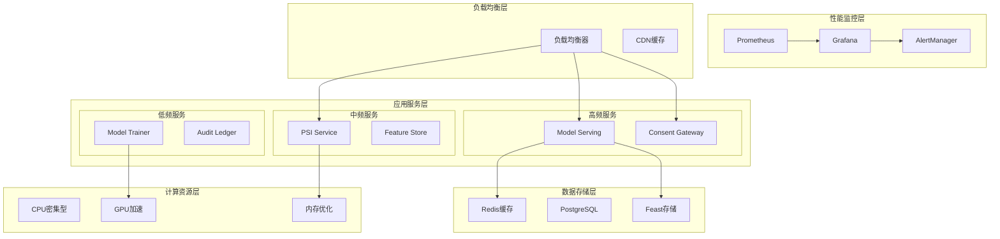

# 性能方案与基准方法

## 性能目标概览

### 核心性能指标

| 指标类别 | 指标名称 | 目标值 | 测量方法 | 业务影响 |
|----------|----------|--------|----------|----------|
| **数据对齐** | PSI吞吐量 | ≥10万/秒 | bench/psi-bench | 客户体验 |
| **数据对齐** | 十亿级对齐 | ≤24小时 | 压测脚本 | 批处理效率 |
| **联合训练** | 10万样本训练 | ≤24小时 | train-bench | 模型更新频率 |
| **在线推理** | /score延迟 | P95<100ms | Prometheus | 实时决策 |
| **在线推理** | /score吞吐 | ≥1000 QPS | 压测工具 | 并发处理 |
| **系统可用性** | 服务可用率 | ≥99.9% | 监控系统 | 业务连续性 |

### 性能架构图



## 数据对齐性能方案

### PSI性能优化

#### 算法选择与优化

```python
class OptimizedPSI:
    """优化的PSI实现"""
    
    def __init__(self, optimization_level: str = "balanced"):
        self.optimization_level = optimization_level
        self.batch_size = self._get_optimal_batch_size()
        self.thread_pool_size = self._get_optimal_thread_count()
        
    def _get_optimal_batch_size(self) -> int:
        """根据内存和网络条件确定最优批次大小"""
        available_memory = psutil.virtual_memory().available
        network_bandwidth = self._estimate_bandwidth()
        
        if self.optimization_level == "memory":
            return min(10000, available_memory // (1024 * 1024))  # 1MB per item
        elif self.optimization_level == "speed":
            return min(100000, network_bandwidth * 1000)  # 基于带宽
        else:  # balanced
            return min(50000, available_memory // (2 * 1024 * 1024))
    
    def _get_optimal_thread_count(self) -> int:
        """确定最优线程数"""
        cpu_count = os.cpu_count()
        
        if self.optimization_level == "speed":
            return min(cpu_count * 2, 32)  # 超线程
        else:
            return min(cpu_count, 16)  # 保守策略
    
    def compute_intersection_optimized(self, local_set: Set[str], 
                                     remote_hashes: List[str]) -> Set[str]:
        """优化的交集计算"""
        # 1. 预处理：排序和去重
        local_sorted = sorted(list(set(local_set)))
        remote_sorted = sorted(list(set(remote_hashes)))
        
        # 2. 分批处理
        intersection = set()
        
        with ThreadPoolExecutor(max_workers=self.thread_pool_size) as executor:
            # 分批提交任务
            futures = []
            for i in range(0, len(local_sorted), self.batch_size):
                batch = local_sorted[i:i + self.batch_size]
                future = executor.submit(self._compute_batch_intersection, 
                                       batch, remote_sorted)
                futures.append(future)
            
            # 收集结果
            for future in as_completed(futures):
                batch_intersection = future.result()
                intersection.update(batch_intersection)
        
        return intersection
    
    def _compute_batch_intersection(self, local_batch: List[str], 
                                  remote_sorted: List[str]) -> Set[str]:
        """计算批次交集"""
        # 使用二分查找优化
        intersection = set()
        
        for item in local_batch:
            # 二分查找
            left, right = 0, len(remote_sorted) - 1
            while left <= right:
                mid = (left + right) // 2
                if remote_sorted[mid] == item:
                    intersection.add(item)
                    break
                elif remote_sorted[mid] < item:
                    left = mid + 1
                else:
                    right = mid - 1
        
        return intersection
    
    def benchmark_performance(self, data_sizes: List[int]) -> Dict:
        """性能基准测试"""
        results = {}
        
        for size in data_sizes:
            # 生成测试数据
            local_data = {f"user_{i}" for i in range(size)}
            remote_data = [f"user_{i}" for i in range(size // 2, size + size // 2)]
            
            # 测试性能
            start_time = time.time()
            intersection = self.compute_intersection_optimized(local_data, remote_data)
            end_time = time.time()
            
            # 计算指标
            duration = end_time - start_time
            throughput = size / duration
            memory_usage = psutil.Process().memory_info().rss / 1024 / 1024  # MB
            
            results[size] = {
                'duration_seconds': duration,
                'throughput_per_second': throughput,
                'memory_usage_mb': memory_usage,
                'intersection_size': len(intersection)
            }
        
        return results
```

#### PSI性能基准

```bash
#!/bin/bash
# bench/psi-bench/run.sh - PSI性能测试脚本

set -e

echo "=== PSI性能基准测试 ==="

# 测试配置
DATA_SIZES=(1000 10000 100000 1000000 10000000)
OPTIMIZATION_LEVELS=("memory" "speed" "balanced")
OUTPUT_DIR="reports/psi_bench"

# 创建输出目录
mkdir -p $OUTPUT_DIR

# 清理之前的结果
rm -f $OUTPUT_DIR/*.csv $OUTPUT_DIR/*.png

echo "开始PSI性能测试..."
echo "数据规模: ${DATA_SIZES[*]}"
echo "优化级别: ${OPTIMIZATION_LEVELS[*]}"
echo ""

# 生成CSV头部
echo "data_size,optimization_level,duration_seconds,throughput_per_second,memory_usage_mb,intersection_size,cpu_usage_percent,network_io_mb" > $OUTPUT_DIR/psi_benchmark.csv

# 执行测试
for opt_level in "${OPTIMIZATION_LEVELS[@]}"; do
    echo "测试优化级别: $opt_level"
    
    for size in "${DATA_SIZES[@]}"; do
        echo "  测试数据规模: $size"
        
        # 启动系统监控
        python3 bench/psi-bench/monitor.py --output $OUTPUT_DIR/monitor_${opt_level}_${size}.json &
        MONITOR_PID=$!
        
        # 执行PSI测试
        start_time=$(date +%s.%N)
        
        python3 bench/psi-bench/psi_test.py \
            --data-size $size \
            --optimization-level $opt_level \
            --output $OUTPUT_DIR/result_${opt_level}_${size}.json
        
        end_time=$(date +%s.%N)
        duration=$(echo "$end_time - $start_time" | bc)
        
        # 停止监控
        kill $MONITOR_PID 2>/dev/null || true
        wait $MONITOR_PID 2>/dev/null || true
        
        # 解析结果
        result_file="$OUTPUT_DIR/result_${opt_level}_${size}.json"
        if [ -f "$result_file" ]; then
            throughput=$(jq -r '.throughput_per_second' $result_file)
            memory_usage=$(jq -r '.memory_usage_mb' $result_file)
            intersection_size=$(jq -r '.intersection_size' $result_file)
            
            # 获取系统指标
            monitor_file="$OUTPUT_DIR/monitor_${opt_level}_${size}.json"
            if [ -f "$monitor_file" ]; then
                cpu_usage=$(jq -r '.avg_cpu_percent' $monitor_file)
                network_io=$(jq -r '.total_network_io_mb' $monitor_file)
            else
                cpu_usage="N/A"
                network_io="N/A"
            fi
            
            # 写入CSV
            echo "$size,$opt_level,$duration,$throughput,$memory_usage,$intersection_size,$cpu_usage,$network_io" >> $OUTPUT_DIR/psi_benchmark.csv
            
            echo "    耗时: ${duration}s, 吞吐: ${throughput}/s, 内存: ${memory_usage}MB"
        else
            echo "    测试失败: 结果文件不存在"
        fi
        
        # 清理临时文件
        rm -f $OUTPUT_DIR/result_${opt_level}_${size}.json
        rm -f $OUTPUT_DIR/monitor_${opt_level}_${size}.json
        
        # 等待系统恢复
        sleep 2
    done
    
    echo ""
done

# 生成性能报告
echo "生成性能报告..."
python3 bench/psi-bench/generate_report.py \
    --input $OUTPUT_DIR/psi_benchmark.csv \
    --output $OUTPUT_DIR/psi_performance_report.md

# 生成性能图表
echo "生成性能图表..."
python3 bench/psi-bench/plot_performance.py \
    --input $OUTPUT_DIR/psi_benchmark.csv \
    --output-dir $OUTPUT_DIR

echo "PSI性能测试完成！"
echo "结果文件:"
echo "  - CSV数据: $OUTPUT_DIR/psi_benchmark.csv"
echo "  - 性能报告: $OUTPUT_DIR/psi_performance_report.md"
echo "  - 性能图表: $OUTPUT_DIR/*.png"
echo ""

# 显示关键指标
echo "=== 关键性能指标 ==="
echo "最高吞吐量:"
awk -F',' 'NR>1 {print $4, $1, $2}' $OUTPUT_DIR/psi_benchmark.csv | sort -nr | head -1 | while read throughput size opt; do
    echo "  $throughput 条/秒 (数据规模: $size, 优化: $opt)"
done

echo "十亿级处理时间估算:"
max_throughput=$(awk -F',' 'NR>1 {print $4}' $OUTPUT_DIR/psi_benchmark.csv | sort -nr | head -1)
if [ "$max_throughput" != "" ] && [ "$max_throughput" != "0" ]; then
    billion_time=$(echo "scale=2; 1000000000 / $max_throughput / 3600" | bc)
    echo "  ${billion_time} 小时 (基于最高吞吐量 $max_throughput 条/秒)"
else
    echo "  无法计算 (吞吐量数据无效)"
fi

echo "内存使用峰值:"
max_memory=$(awk -F',' 'NR>1 {print $5}' $OUTPUT_DIR/psi_benchmark.csv | sort -nr | head -1)
echo "  ${max_memory} MB"

echo ""
echo "详细结果请查看: $OUTPUT_DIR/psi_performance_report.md"