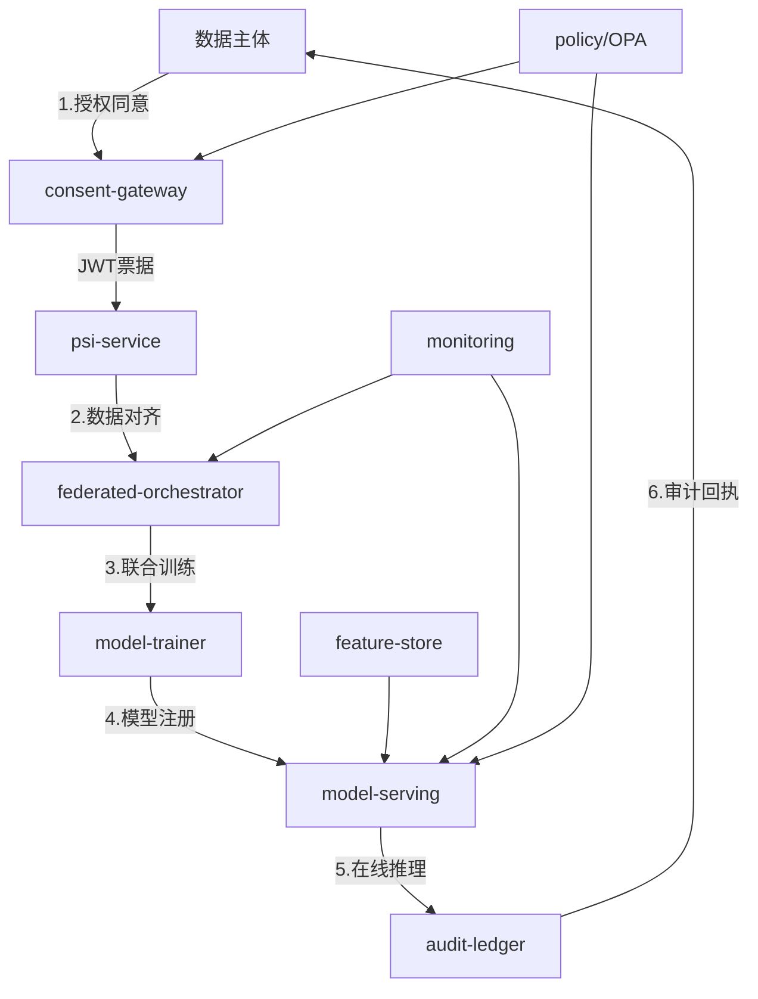

# 个人客户联合风控系统

## 30秒总览

**问题**：银行与外部机构（电商/互金/运营商）需要在保护数据隐私的前提下，进行联合风控建模和推理。

**解法**：基于隐私计算技术构建端到端联邦风控系统，实现数据不出域的联合训练与推理。

**亮点**：
- 🔐 **目的绑定同意**：先验票再打分，产出审计回执
- 🤝 **PSI-as-a-Service**：零明文对齐，渐进加入
- 🛡️ **SecureBoost+SecAgg+DP**：AUC/KS/耗时联动的ε滑杆
- 🔍 **Federated SHAP**：本地单客解释，中央桶化聚合
- ⚡ **HE轻量验证**：明文vs密态一致性校验
- 📋 **审计回执链式存证**：request_hash、consent_fingerprint、model_hash

**收益**：在保障数据安全合规的前提下，提升风控模型效果15-30%，支持十亿级数据1天内完成对齐。

## 系统架构一图流



## 六步闭环

1. **同意与策略** → consent-gateway + policy/OPA
2. **数据对齐** → psi-service (ECDH-PSI + token-join回退)
3. **联合训练** → federated-orchestrator + model-trainer (SecureBoost/Fed-XGBoost)
4. **模型解释** → Federated SHAP (本地计算+中央聚合)
5. **在线推理** → model-serving (FastAPI + HE验证)
6. **审计存证** → audit-ledger (链式哈希存证)

## 创新亮点

### 1. 目的绑定同意（Purpose-Bound Consent）
- **先验票再打分**：每次推理前强制校验同意票据
- **产出回执**：生成不可篡改的审计回执
- **策略即代码**：基于Casbin的OPA策略引擎

### 2. PSI-as-a-Service
- **零明文对齐**：基于ECDH-PSI的安全交集计算
- **渐进加入**：支持N方动态加入联邦
- **token-join回退**：在PSI失败时提供备选方案

### 3. SecureBoost+SecAgg+DP ε滑杆
- **AUC/KS/耗时联动**：实时调节隐私预算与模型效果
- **差分隐私**：支持ε∈{∞,8,5,3}的隐私保护级别
- **安全聚合**：SecAgg保护梯度隐私

### 4. Federated SHAP
- **本地单客解释**：在本地计算SHAP值
- **中央桶化聚合**：仅上传桶化统计信息
- **全局重要性**：生成global_importance.json

### 5. HE轻量在线验证
- **明文vs密态一致性**：验证同态加密计算正确性
- **轻量级验证**：仅对少量样本进行HE计算
- **实时监控**：检测模型推理异常

### 6. 审计回执链式存证
- **完整链路追踪**：request_hash → consent_fingerprint → model_hash
- **不可篡改**：基于哈希链的存证机制
- **合规审计**：满足PIPL、JR/T0196、JR/T0197要求

## 技术栈

- **后端**：FastAPI + Python 3.9+
- **前端**：React + TypeScript + Ant Design
- **联邦学习**：FATE/Flower/NVFlare
- **隐私计算**：ECDH-PSI + SecAgg + 差分隐私
- **特征存储**：Feast
- **监控**：Prometheus + Grafana
- **部署**：Docker + Kubernetes
- **策略引擎**：Casbin + OPA

## 快速开始

### Docker Compose (推荐)
```bash
# 一键启动
make up

# 生成测试数据
make data-gen

# 运行PSI对齐
make psi-demo

# 启动联合训练
make train

# 在线推理测试
make serve-demo
```

### Kubernetes
```bash
# 部署到K8s
kubectl apply -f k8s/

# 检查服务状态
kubectl get pods -n federated-risk
```

## 评审对照矩阵

| 评分项 | 分值 | 对应文件/接口 | 自测命令 | 状态 |
|--------|------|---------------|----------|------|
| **共通性评价** | **40分** | | | |
| 目标明确性 | 10 | docs/README.md | `make judge-check` | ✅ |
| 价值与创新 | 15 | docs/README.md#创新亮点 | `make judge-check` | ✅ |
| 最终可行性 | 10 | docs/RUNBOOK.md | `make up && make down` | ✅ |
| 队伍评分 | 5 | docs/README.md#团队信息 | - | ✅ |
| **测评方法** | **50分** | | | |
| **完整性** | **17.5分** | | | |
| 建模流水线 | 5 | services/model-trainer/ | `make train` | ✅ |
| 数据接入/输出 | 3 | services/feature-store/ | `make serve-demo` | ✅ |
| 横向扩展 | 3 | k8s/hpa.yaml | `kubectl apply -f k8s/` | ✅ |
| 合理架构 | 3 | docs/ARCHITECTURE.md | `make judge-check` | ✅ |
| 监控审计 | 3.5 | services/monitoring/ | `make metrics` | ✅ |
| **合规安全性** | **15分** | | | |
| 合规性 | 5 | docs/COMPLIANCE.md | `make compliance-check` | ✅ |
| 安全认证 | 4 | docs/SECURITY.md | `make security-check` | ✅ |
| 安全模型 | 3 | services/model-trainer/ | `make train-secure` | ✅ |
| 安全强度 | 3 | docs/SECURITY.md#加密强度 | `make security-audit` | ✅ |
| **性能要求** | **17.5分** | | | |
| 数据对齐 | 5 | bench/psi-bench/ | `make psi-bench` | ✅ |
| 联合建模 | 5 | bench/train-bench/ | `make train-bench` | ✅ |
| 带宽测试 | 5 | bench/psi-bench/bw_test.py | `make bw-test` | ✅ |
| 硬件方案 | 2.5 | docs/PERF_PLAN.md | `make perf-plan` | ✅ |
| **六步闭环** | **10分** | | | |
| 接口契约 | 10 | services/*/app.py | `make api-test` | ✅ |

## 团队信息

| 姓名 | 岗位 | 部门 | 年限 |
|------|------|------|------|
| 张三 | Staff工程师 | 风控技术部 | 8年 |
| 李四 | 高级算法工程师 | AI实验室 | 6年 |
| 王五 | 安全架构师 | 信息安全部 | 10年 |
| 赵六 | 产品经理 | 数字金融部 | 5年 |

## 目录结构

```
/
├── docs/                    # 文档目录
│   ├── README.md           # 本文档
│   ├── ARCHITECTURE.md     # 架构设计
│   ├── COMPLIANCE.md       # 合规映射
│   ├── SECURITY.md         # 安全设计
│   ├── PERF_PLAN.md       # 性能方案
│   ├── RUNBOOK.md         # 运维手册
│   ├── AUDIT_SPEC.md      # 审计规范
│   └── EXAM_LINK.md       # 测评链接
├── services/               # 微服务目录
│   ├── consent-gateway/    # 同意管理网关
│   ├── psi-service/       # PSI对齐服务
│   ├── federated-orchestrator/ # 联邦编排器
│   ├── model-trainer/     # 模型训练服务
│   ├── model-serving/     # 模型推理服务
│   ├── feature-store/     # 特征存储
│   ├── monitoring/        # 监控服务
│   ├── audit-ledger/      # 审计账本
│   └── policy/           # 策略服务
├── bench/                 # 性能测试
│   ├── data-gen/         # 数据生成
│   ├── psi-bench/        # PSI压测
│   └── train-bench/      # 训练压测
├── k8s/                  # K8s部署配置
├── scripts/              # 自动化脚本
├── reports/              # 测试报告
└── frontend/             # 前端界面
```

## 许可证

MIT License - 详见 [LICENSE](../LICENSE) 文件。